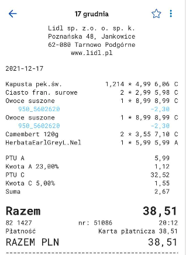

# analizator

https://yourshoppinganalyzer.azurewebsites.net/

 
## How to implement this innovation in real life?

We have three solutions:

# 1.
Every shop has the same names for every products. In this case our app could recognize everything and could be use in every shop based  only on one "products dictonary".

# 2. 
Many shops have their own app, for example Lidl has app where our receipts are stored.

 

It will be really easy to add our module for their app! Customers could have automatically updated e-fridge in their app.

# 3.
We have also one more idea which could help everyone control products' terms of validity even if this person don't have spartphone or computer!
During scanning of purchases system could sort them by terms of validity. Then, person at home just takes a look for the top of receipt and will know what to eat first.

