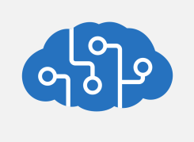
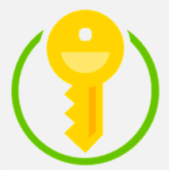
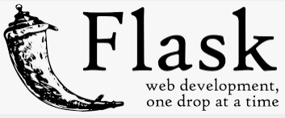

https://yourshoppinganalyzer.azurewebsites.net/

# No more food waste!
The project was a part of the course *Introduction to applications and solutions based on Artificial Intelligence and Microsoft Azure* at the Warsaw University of Technology.

## Table of contents
* [Description and the goal of the project](#description)
* [Contributors](#contributors)
* [Functionality description](#functionality)
* [Architecture](#architecture)
* [Tech Stack](#tech-stack)
* [User Guide](#user-guide)
* [Demo](#demo)
* [How to implement this innovation in real life?](#innovation)

## Description and the goal of the project
According to the UN report, on average each person throws away 74 kg of food products. This is controversial information to know that approximately 690 million people are malnourished. Food waste and losses are responsible for around 10% of the emissions causing the climate crisis. In Poland, 153 kilograms of food are thrown into the bin every second. Annually, we waste 4.8 million tons of food in Poland. To prevent further food waste, we decided to create a web application that allows us to monitor the contents of our fridge and informs us which products are ending the expiry date so that we can consume the product and not have to throw it away.

<a href="https://klimat.rp.pl/ekotrendy/art17074151-raport-onz-miliard-ton-zywnosci-rocznie-laduje-na-smietniku" target="_blank">Link to data about food waste</a>

## Contributors
* <a href="https://github.com/gubapatryk" target="_blank">Patryk Guba</a>
* <a href="https://github.com/mjakubowska" target="_blank">Martyna Jakubowska</a>
* <a href="https://github.com/kingakocol" target="_blank">Kinga Kocoł</a>
* <a href="https://github.com/Olakow" target="_blank">Aleksandra Kowalczyk</a>
* <a href="https://github.com/maxxx958" target="_blank">Maxymilian Kowalski</a>
* <a href="https://github.com/AleksanderWodnicki" target="_blank">Aleksander Wodnicki</a>

## Functionality description
The web application allows you to add and store products in a virtual fridge. In addition to the names of the products, the use-by date of the individual products is also displayed. There are two ways to add ingredients. The first one allows you to add a photo of the sales receipt, then, using OCR, the names of products are extracted from the receipt, appropriate expiration dates are assigned and placed in the fridge. The second way is to manually add products, just enter the product name and the expiration date of the product. The products in the fridge are sorted by their use-by date.

## Architecture

 

## Tech Stack

### Azure App Service Web Apps

 

 
 

 
Quickly and easily create enterprise-ready web and mobile apps for any platform or device, and deploy them on a scalable and reliable cloud infrastructure.
 
Documentation: https://azure.microsoft.com/en-us/services/app-service/#documentation
Pricing: https://azure.microsoft.com/en-us/services/app-service/#pricing

### Azure Cognitive Services Computer Vision 

 

 
 

 
An AI service that analyzes content in images and video.

Documentation: https://docs.microsoft.com/en-us/azure/cognitive-services/computer-vision/
Pricing: https://azure.microsoft.com/en-us/services/cognitive-services/computer-vision/#pricing
 
### Azure Cognitive Services Computer Vision Optical Character Recognition

The Optical Character Recognition (OCR) service extracts text from images. You can use the new Read API to extract printed and handwritten text from photos and documents. It uses deep-learning-based models and works with text on a variety of surfaces and backgrounds. These include business documents, invoices, receipts, posters, business cards, letters, and whiteboards. 

Quickstart: https://docs.microsoft.com/en-us/azure/cognitive-services/computer-vision/quickstarts-sdk/client-library?tabs=visual-studio
Language support: https://docs.microsoft.com/en-us/azure/cognitive-services/computer-vision/language-support

### Azure Key Vault

 

 
 

 
Safeguard cryptographic keys and other secrets used by cloud apps and services.
 
Documentation: https://azure.microsoft.com/en-us/services/key-vault/#documentation
Pricing: https://azure.microsoft.com/en-us/pricing/details/key-vault/

### Flask

 

 
 

 
 Flask is a micro web framework written in Python. Flask depends on the Jinja template engine and the Werkzeug WSGI toolkit. 
 
Documentation: https://flask.palletsprojects.com/en/2.0.x/

## User Guide

After starting our web application from the link provided or locally, we will see the following screen:

 
From here we can either check what products are in our _fridge_ or upload a new receipt to our database and thus add new products to our _fridge_!

Let’s begin by adding a new receipt. In order to do that we have to choose _Add a new receipt_ option, and then add a proper image of our receipt. We can repeat the process with all the receipts we have.

  
Once we upload a receipt, we can click on _Check_ button in order to see what products are on the receipt and they will be added to our _fridge_ automatically.

 

 

 
Now we can go back to the start page and click on _What is in my fridge?_ Button. We will see that there is a list of the products from our receipts sorted by their use-by date.

 

 
There is also an alternative option of adding products. We can see that at the bottom of the list that shows us all the products from our _fridge_, there’s a button called _Add new product_. After clicking this button, we can add our products manually – we will see two fields: _Product name_ and _Expire date_. In the first field, we can add the name of the product, and in the second one, we set its expiration date.

 

 
After clicking _Add product_ button, we will be redirected to our _fridge_, and we will be able to see this new product there (marked in yellow):

 

## Demo

By clicking the picture below, you will be redirected to the YouTube video of the demo that was prepared for this project.

## How to implement this innovation in real life?

We have three solutions:

1. Every shop has the same names for every products. In this case our app could recognize everything and could be use in every shop based only on one "products dictonary".

2. Many shops have their own app, for example Lidl has app where our receipts are stored. It will be really easy to add our module for their app! Customers could have automatically updated e-fridge in their app.

3. We have also one more idea which could help everyone control products' terms of validity even if this person doesn't have smartphone or computer! During scanning of purchases system could sort them by terms of validity. Then, person at home just takes a look for the top of receipt and will know what to eat first.

## Task List

1. TODO by **31.12.2021**:
* **Patryk Guba**:
    * [x] Create a receipt database
* **Martyna Jakubowska & Aleksandra Kowalczyk**:
    * [x] Create application’s framework
    * [x] Add OCR
    * [x] Connect to App Service
* **Maxymilian Kowalski**:
    * [x] Create a module in Python that would convert text from a receipt into a list of products
    * [x] Create a list of products from the receipt database

2. TODO by **11.01.2022**:
* **Kinga Kocoł**:
    * [x] Create a GUI (Home page with separate links to virtual fridge and page with receipt analyzer)
* **Aleksander Wodnicki**:
    * [x] Create a module in Python that would be setting expiration date to particular products
    * [x] Classify products into their categories (and set expiry date to them)

3. TODO by **25.11.2022**:
* **Patryk Guba**:
    * [x] Create Architecture Diagram 
* **Martyna Jakubowska**:
    * [x] Fix problems related to Azure
    * [x] Record a demo
* **Kinga Kocoł**:
    * [x] GUI adjustments
    * [x] Enable user to see the products in the fridge
    * [x] Add a form to add products manually
    * [x] Create a detailed description of a project on GitHub
    * [x] Prepare demo’s script
* **Aleksandra Kowalczyk**:
    * [x] Integrate with Key Vault
    * [x] Describe Tech Stack and Innovation's Implementation on GitHub
    * [x] Record a demo
* **Aleksander Wodnicki**:
    * [x] Prepare demo’s script
    * [x] Record and edit a demo
    * [x] Prepare English transcript of the demo
    * [x] Prepare User Guide and Task List on GitHub
