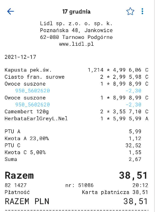

https://yourshoppinganalyzer.azurewebsites.net/

# No more food waste!
The project was a part of the course *Introduction to applications and solutions based on Artificial Intelligence and Microsoft Azure* at the Warsaw University of Technology.

## Table of contents
* [Description and the goal of the project](#description)
* [Contributors](#contributors)
* [Functionality description](#functionality)
* [Architecture](#architecture)
* [Tech Stack](#tech-stack)
* [User Guide](#user-guide)
* [Demo](#demo)
* [How to implement this innovation in real life?](#innovation)

## Description and the goal of the project
According to the UN report, on average each person throws away 74 kg of food products. This is controversial information to know that approximately 690 million people are malnourished. Food waste and losses are responsible for around 10% of the emissions causing the climate crisis. In Poland, 153 kilograms of food are thrown into the bin every second. Annually, we waste 4.8 million tons of food in Poland. To prevent further food waste, we decided to create a web application that allows us to monitor the contents of our fridge and informs us which products are ending the expiry date so that we can consume the product and not have to throw it away.

<a href="https://klimat.rp.pl/ekotrendy/art17074151-raport-onz-miliard-ton-zywnosci-rocznie-laduje-na-smietniku" target="_blank">Link to data about food waste</a>

## Contributors
* <a href="https://github.com/gubapatryk" target="_blank">Patryk Guba</a>
* <a href="https://github.com/mjakubowska" target="_blank">Martyna Jakubowska</a>
* <a href="https://github.com/kingakocol" target="_blank">Kinga Kocoł</a>
* <a href="https://github.com/Olakow" target="_blank">Aleksandra Kowalczyk</a>
* <a href="https://github.com/maxxx958" target="_blank">Maxymilian Kowalski</a>
* <a href="https://github.com/AleksanderWodnicki" target="_blank">Aleksander Wodnicki</a>

## Functionality description

## Architecture
Tutaj trzeba dodać diagram

## Tech Stack

## User Guide

## Demo
 
 
## How to implement this innovation in real life?

We have three solutions:

1. Every shop has the same names for every products. In this case our app could recognize everything and could be use in every shop based  only on one "products dictonary".

2. Many shops have their own app, for example Lidl has app where our receipts are stored. It will be really easy to add our module for their app! Customers could have automatically updated e-fridge in their app.

 
 

3. We have also one more idea which could help everyone control products' terms of validity even if this person don't have spartphone or computer! During scanning of purchases system could sort them by terms of validity. Then, person at home just takes a look for the top of receipt and will know what to eat first.
